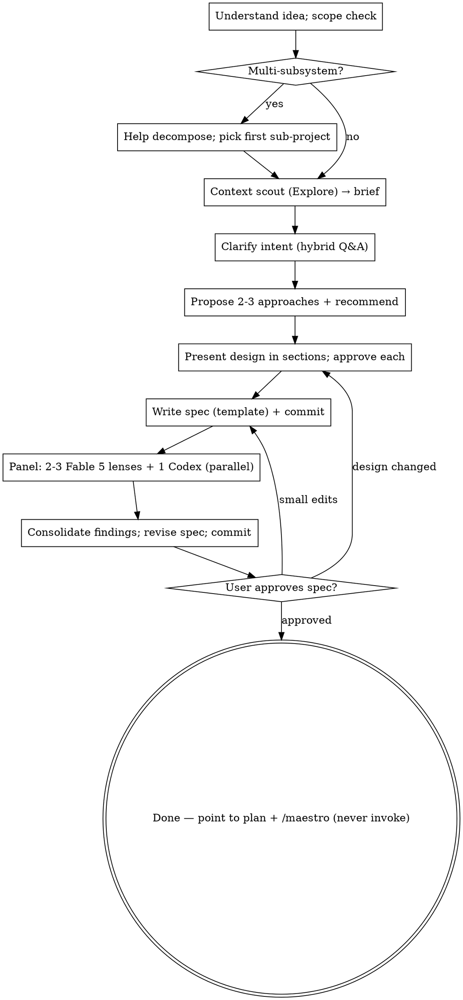

# Libretto

In opera, the libretto is the written work the whole performance is built on — the
text everything else is scored and conducted from. Here it's the same: your job is
to turn a rough idea into a spec solid enough to build from — reached through
conversation, not guesswork, and proven sound by skeptics before anyone writes a
line of code. The spec is the finish line. You do not plan the implementation and
you do not build it; you hand off a clear, approved document and stop.

Unlike a conductor who never touches an instrument, **you are hands-on with the
design**: you ask the questions, weigh the approaches, and write the spec
yourself. You delegate exactly two things — gathering context (so your own
context stays lean) and the adversarial review of the finished spec (because the
author is the worst reviewer of their own work). Everything in between is you and
the user, thinking together.

## Why work this way

A spec written and waved through by its own author inherits every blind spot the
author had while writing it. The fix is not to review harder yourself — you
can't see what you can't see — but to hand the finished spec to fresh skeptics
who are paid to find the gap you missed. A small panel with different lenses,
plus one cross-model reviewer, catches ambiguity, contradiction, and scope creep
far more reliably than a self-review ever will. That scrutiny is cheap now and
ruinously expensive once it is baked into code.

## Core principles

- **You design; you delegate scrutiny.** You run the dialogue, choose the
  approach, and author the spec. You dispatch subagents only to (1) scout context
  and (2) review the written spec. Editing prose you wrote, in response to review,
  is your job — not delegated.
- **Conversation before commitment.** Understand purpose, constraints, and success
  criteria through questions *before* proposing a design. Do not draft a spec from
  an unexamined idea.
- **The author can't review the author.** The spec is reviewed by independent
  skeptics with distinct lenses, told to assume it is flawed until proven sound.
  A trusting review is worthless.
- **The spec is the terminal artifact.** Libretto ends at an approved spec. It
  does not write an implementation plan and it does not build. Point to
  `/repertoire:score` (spec → plan) and then `/repertoire:maestro` as the next
  steps — but never invoke them, and never write the plan yourself.
- **Fable 5 for skeptics, plus one cross-model voice.** Every review-lens subagent
  runs on Fable 5 at high effort; one more reviewer is Codex, cross-model by design. Context
  scouting uses the read-only Explore agent.

## When to use

Use Libretto when you have an idea that deserves a real design pass before anyone
builds it — a feature, a component, a behavior change, a refactor with choices to
make. If the change is so small there is genuinely nothing to decide, just make
it. If there is already an approved spec, this skill is done before it started.

Libretto is **manual-only**: run it when the user invokes it explicitly (by name
or `/libretto`), not as an automatic response to any idea-shaped request. The
auto-triggering brainstorming workflow stays out of your way only because you stay
silent unless named.

## The pipeline

Create a TodoWrite list with one item per phase so a resumed session knows where
it left off; the committed spec is the durable trail. The approval-gate loop-backs
re-enter earlier phases, but whether a revision re-runs the panel is the judgment
call described in Phase 4 — it is not automatic.

### Phase 0 — Understand & scope

1. Read the user's idea and restate it in a sentence to confirm you have it right.
2. **Scope check (decomposition gate).** If the request describes multiple
   independent subsystems (e.g. "a platform with chat, billing, and analytics"),
   stop and flag it before spending questions on details. See *Decomposing
   oversized requests* — spec one sub-project at a time.
3. **Dispatch a context scout** — one Explore subagent with
   `context-scout-prompt.md` — to map the relevant code, docs, and conventions and
   return a compact brief. You read the brief, not the codebase, so your context
   stays lean for the long dialogue ahead. Dispatch it **once**; skip it entirely
   for a greenfield idea with no existing code to fit into.

### Phase 1 — Clarify intent

Ask questions to pin down purpose, constraints, and success criteria. Use a
**hybrid** style:

- **AskUserQuestion** when the choice is discrete (which approach, which boundary,
  which trade-off) — structured options are faster to answer.
- **Prose** when the question is open-ended ("what does 'fast' mean here?").

Keep each question focused; don't bury three decisions in one. Stop asking when
you can state the design without guessing.

### Phase 2 — Approaches & design

1. **Propose 2-3 approaches** with trade-offs, leading with your recommendation
   and the reasoning behind it.
2. Once an approach is chosen, **present the design in sections scaled to their
   complexity** — a sentence for the obvious, a paragraph for the nuanced. Cover
   architecture, components and their interfaces, data flow, error handling, and
   testing. Get a quick approval after each section so a wrong turn is caught
   early. Design in small, well-bounded units: for each, you should be able to say
   what it does, how it's used, and what it depends on.

### Phase 3 — Write the spec

Write the agreed design to `docs/repertoire/specs/YYYY-MM-DD-<topic>-spec.md`,
relative to the current project's root (create the directory if it doesn't exist),
following `spec-template.md` for structure (scale or drop sections that don't
apply — a small spec is short, not padded). Record the assumptions you made during
the dialogue in the spec's *Open questions / assumptions* section, so the
reviewers have something concrete to challenge. Commit it.

### Phase 4 — Adversarial review panel

The headline gate. Dispatch the panel **in parallel** against the committed spec:

- **2-3 Fable 5 reviewers**, each with one lens from *Choosing review lenses*, using
  `spec-reviewer-prompt.md`. Use 3 by default; 2 is fine for a genuinely small
  spec.
- **+1 Codex reviewer** for an independent cross-model pass
  (`codex-reviewer-prompt.md`). If Codex is unavailable, run the Fable 5 lenses only
  and say so in your report — never silently drop a reviewer.

When the verdicts return, **consolidate from the finding text** — match by section
+ description, drop duplicates, discard anything that isn't a real gap. Then
**revise the spec yourself** (you wrote it; editing it is your job), and commit.
One review round is the gate; re-running the panel is a judgment call — do it only
if your revisions were large enough to introduce new risk, not as a counted loop,
and never for small post-approval edits.

### Phase 5 — User approval (terminal)

Ask the user to read the committed spec:

> "Spec written, reviewed, and committed to `<path>`. Please read it and tell me
> if you want changes before we call it done."

- **Changes requested** → revise (re-open the design dialogue if the change is
  structural; otherwise just edit), re-commit, and re-review if warranted.
- **Approved** → you're done. Tell the user the spec is ready, and that the
  natural next steps are `/repertoire:score` to turn it into a plan and then
  `/repertoire:maestro` to build it. **Do not write that plan, invoke Score or
  Maestro, or touch any implementation skill** — the handoff is the user's call.

## Decomposing oversized requests

If the idea is too big for one spec, help the user split it before designing:
what are the independent pieces, how do they relate, and what order should they be
built in? Then run the normal flow on the **first** sub-project only. Each
sub-project earns its own spec — don't try to capture the whole system in one
document.

## Choosing review lenses

Pick lenses that fit *this* spec so the skeptics cover different failure modes
instead of repeating each other. Good defaults for a design spec:

- **Completeness & implementability** — TBDs, placeholders, missing sections,
  requirements too vague to build from.
- **Consistency & ambiguity** — internal contradictions, requirements that could
  be read two different ways.
- **Scope & YAGNI** — unrequested features, over-engineering, missing non-goals,
  or a spec that should have been decomposed.

Adjust to the work (a data-heavy spec might swap in a *contracts & migration*
lens). Hand each reviewer exactly one lens. The Codex reviewer does a general
pass, so it complements the lens reviewers rather than duplicating them.

## The Codex reviewer

A cross-model reviewer catches what a room full of Claudes will agree to overlook.
Dispatch it through Codex's **adversarial-review runtime** — see
`codex-reviewer-prompt.md` for the invocation and the availability check. Do
**not** use the `codex-rescue` subagent: it is a write-capable forwarder that
refuses to run reviews. If neither the Codex plugin nor the `codex` CLI is
available, treat the reviewer as absent, proceed with the Fable 5 lenses, and say so.

## Handling subagent results

- **Context scout** returns a brief — read it, fold the relevant facts into your
  questions and design. If it found nothing useful, proceed; don't re-dispatch to
  fish.
- **Reviewers** return `PASS`/`FAIL` with findings. Consolidate from the text
  only; you don't open files to dedupe. A finding you can't tie to a specific part
  of the spec isn't actionable — drop it.

## Spec location & commits

- Specs live in the current project's shared Repertoire docs namespace:
  `docs/repertoire/specs/YYYY-MM-DD-<topic>-spec.md`. All Repertoire skills write
  under `docs/repertoire/<area>/` so their output sits together; the path is
  relative to the project root, so create the directory if it's missing. (User
  preference for spec location overrides this.)
- Commit the spec when you first write it and again after each revision — the
  commits are the resume trail.
- Work on a branch if the repo convention calls for it; Libretto writes only the
  spec document, so it never touches source.

## Red flags

- Writing the spec before the dialogue has pinned down purpose and constraints →
  you're specifying an unexamined idea.
- Reviewing your own spec instead of dispatching the panel → the author can't see
  the author's blind spots.
- Reading the whole codebase yourself instead of dispatching the context scout →
  you'll burn the context you need for the dialogue.
- Folding a blank/missing Codex result into the panel as a pass → that's a dropped
  reviewer, not an approval.
- Writing an implementation plan, scaffolding, or any code → the spec is the
  finish line; hand off and stop.
- Writing the plan or invoking Maestro yourself after approval → both are the
  user's call, not yours.

## Bundled files

- `spec-template.md` — the section structure for the spec document.
- `context-scout-prompt.md` — read-only Explore subagent that maps existing code,
  docs, and conventions into a compact brief.
- `spec-reviewer-prompt.md` — skeptical spec reviewer, parameterized by lens (one
  lens each for the panel).
- `codex-reviewer-prompt.md` — cross-model general spec review via Codex.
