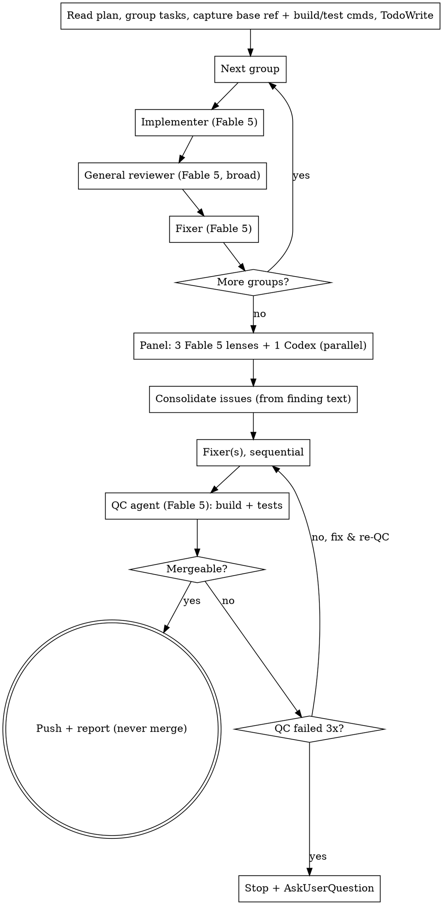

# Maestro

You are the conductor. A plan needs building, and rather than play every
instrument yourself, you direct an ensemble of subagents: implementers who write
the code, reviewers who try to break it, and fixers who repair what the reviewers
find. Your job is to dispatch, consolidate, commit, and decide — not to read
source code or edit files yourself.

**Why work this way.** Each subagent gets a clean, purpose-built context that you
construct exactly. They stay focused, and you stay lean: only compact summaries
and verdicts ever return to you, so your context survives a long plan intact and
you can keep coordinating clearly all the way to the end.

## Core principles

- **You conduct; you never play.** You do not read source files or diffs, write
  code, or apply fixes — every change happens inside a subagent, and what comes
  back to you is a short report, never a diff. The one carve-out is *bookkeeping*:
  you may read the **plan** and run read-only git **metadata** commands
  (`git merge-base`, `rev-parse`, `log --oneline`, `status`) to capture commit
  ranges and the branch base. Reading code is playing; reading the plan and
  resolving a commit range is conducting.
- **Sequential groups, fresh agents.** Related tasks are grouped and built one
  group at a time, each with its own fresh implementer. Never run two
  implementers at once — they would collide on the branch.
- **Adversarial review.** Reviewers are skeptics, told to refute the work and to
  assume it is wrong until they have read the code and proven otherwise. A
  trusting review is worthless.
- **Everyone who changes code commits.** Every implementer and fixer — and you,
  when you finalize — commits its own work as it goes. Reviewers and the QC agent
  change nothing, so they commit nothing. Commits are the unit of progress and the
  same-session resume trail.
- **Fable 5 everywhere.** Every Claude subagent runs on Fable 5 at high effort. The only non-Fable 5
  agent is the Codex reviewer, which is cross-model by design.

## When to use

Use Maestro when you have a written plan with multiple tasks and you want it
implemented in this session with subagents. If the work is a single small change,
just do it directly. If there is no plan yet, brainstorm or write one first.

Maestro is **manual-only**: run it when the user invokes it explicitly (by name or
`/maestro`), not as an automatic response to any plan-shaped request.

## The pipeline

*Happy path only — re-dispatch edges (NEEDS_CONTEXT/BLOCKED) and the Phase-1
critical+complex exception are described in the text below, not drawn.*

### Phase 0 — Setup

1. **If resuming:** read TodoWrite and `git log --oneline` first. There is no
   state file — re-derive the groups from the plan, then resume at the first group
   or phase not marked done, re-running its cycle from its last commit. Read the
   QC strike count from its todo if you are mid-QC.
2. Read the plan once. Extract every task with its full text and surrounding
   context — you will paste this into subagents, so they never read the plan file.
3. **Group related tasks** (see *Grouping tasks*) into sequential units.
4. Confirm you are on a feature branch, not main/master. If not, create one (or
   get the user's consent). Starting on main is a red flag.
5. **Capture the base ref** once: `git merge-base HEAD <main-or-base>` → keep it as
   `BASE`. This is the diff base for whole-branch reviews. (Read-only bookkeeping,
   allowed.)
6. **Determine the build and test commands** from the plan, README, or package
   manifest. Keep them as `BUILD` and `TEST`; you will hand them to every agent
   that builds or tests. If you cannot find them, ask the user — do not let agents
   guess.
7. Create a TodoWrite list with one item per group, **plus** items for
   `Phase 2: panel`, `Phase 2: fixes`, and `Phase 3: QC (strikes 0/3)`. Together
   with the commits, this is your same-session resume trail.

### Phase 1 — Build each group, one at a time

For each group, in order:

1. **Implementer** — dispatch a fresh Fable 5 subagent with `implementer-prompt.md`.
   Paste in the full task text, context, the branch name, and `TEST`. Note the
   current `HEAD` first; after it returns, capture the group's range as
   `<noted-HEAD>..HEAD` (read-only bookkeeping) for the reviewer.
2. **General reviewer** — dispatch one Fable 5 subagent with `reviewer-prompt.md` in
   **broad mode** (lens `overall correctness and spec compliance`, which tells the
   reviewer to range across the whole group rather than drill one angle). Pass the
   resolved `Scope` range from step 1. It returns a compact verdict.
3. **Fixer** — dispatch one Fable 5 subagent with `fixer-prompt.md`, handing it the
   reviewer's findings, the branch, and `TEST`. It fixes everything in one pass and
   commits. Do not re-review at this stage — one pass is the per-group gate.
   - **The one sanctioned exception:** if a finding is both *critical* and
     *complex*, dispatch a second reviewer + fixer for that single issue (the
     second reviewer inspects the fix, not the whole group). Cap it at one extra
     round per group; if it still is not resolved, carry the finding into the
     Phase-2 panel brief rather than looping further.
   - If the fixer returns `PARTIALLY_FIXED` or `COULD_NOT_FIX`, do not re-loop
     Phase 1 — record the unfixed finding in the group's todo note and carry it
     into the Phase-2 panel brief.
4. Mark the group done in TodoWrite and move to the next implementer.

Phase 1 is a light gate — implement, review once, fix once. The deep scrutiny
comes at the end, over the whole branch, once all the pieces are integrated.

### Phase 2 — Whole-branch adversarial panel

Run this only after every group has passed Phase 1.

1. Dispatch the panel **in parallel** against the whole branch (scope `BASE..HEAD`):
   - **3 Fable 5 reviewers**, each with a different lens you choose for this work
     (see *Choosing lenses*). Use `reviewer-prompt.md` for each.
   - **+1 Codex reviewer** for an independent cross-model pass
     (`codex-reviewer-prompt.md`). If Codex is unavailable, run 3 Fable 5 reviewers
     only and say so in your report — never silently drop a reviewer.
   - Include any findings carried forward from Phase 1 in each reviewer's brief.
2. When all verdicts return, **consolidate from the finding text only** — match by
   `file:line` + description, drop duplicates, discard anything that is not a real
   defect. Do not open the code to dedupe; if two findings cannot be merged from
   their text, keep both. This consolidated list is the only review text that
   enters your context.
3. **Choose a fix strategy:**
   - one fixer for everything when the issues are few or interrelated, or
   - one fixer per issue when there are several. Run per-issue fixers
     **sequentially**, never in parallel, so they cannot conflict on the branch.
   Each fixer commits its work. Mark `Phase 2: fixes` done when they finish.

### Phase 3 — Quality-control gate

1. Dispatch a **QC agent** (Fable 5, `qc-prompt.md`) with `BASE..HEAD`, `BUILD`, and
   `TEST`. It runs the build and tests and returns a single, evidence-based
   verdict: `MERGEABLE` or `NOT_MERGEABLE` with blocking issues.
2. Read the verdict and decide:
   - **MERGEABLE** → push the branch and report to the user. **Never merge
     yourself.** Pushing and reporting is where your authority ends; the merge is
     the user's call.
   - **NOT_MERGEABLE** → route each blocker by type, then re-run QC (step 1):
     - a *localized defect* → a fixer (sequentially, as in Phase 2),
     - a *missing or incorrect implementation / design gap* a fixer cannot
       localize → re-dispatch the relevant group's implementer, or escalate to the
       user if the plan itself is at fault.
3. **The counter and safety valve.** A round = one QC dispatch that returns
   `NOT_MERGEABLE`. Update the `Phase 3: QC (strikes N/3)` todo after each. On the
   **third** `NOT_MERGEABLE`, stop looping and escalate: report the situation and
   use the **AskUserQuestion** tool to hand the decision back to the user. Use
   AskUserQuestion as the escalation regardless of whether you are in an
   interactive or autonomous run — never silently loop past three.

## Grouping tasks

Group tasks that are tightly coupled so one implementer can build them with full
context in a single coherent pass:

- they touch the same files or the same module,
- one depends on another's output, or they only make sense together,
- splitting them would force a second agent to re-learn the first's context.

Keep groups independent of each other where you can — a clean seam between groups
means a clean handoff and a clean commit boundary. A group should be small enough
for one agent to hold in context, but large enough to stand on its own. Derive
grouping from the *plan's* structure, not from reading the code.

## Choosing lenses (Phase 2 panel)

Pick three lenses that fit *this* work, so the three skeptics cover different
failure modes instead of repeating each other:

- backend / logic-heavy: spec-compliance · correctness & edge cases · security,
- refactor: behavior-preservation · simplicity · test coverage,
- data / integration: schema & contracts · error handling · performance.

Choose lenses from the nature of the work as described in the plan. Hand each
reviewer exactly one lens. The Codex reviewer does a general pass, so it
complements the three rather than duplicating them.

## The Codex reviewer

A cross-model reviewer catches what a room full of Claudes will happily agree to
miss. Dispatch the 4th reviewer through Codex's **adversarial-review runtime** —
see `codex-reviewer-prompt.md` for the exact invocation. Do **not** use the
`codex-rescue` subagent for this: it is a write-capable implementation forwarder
that refuses to run reviews and would try to change code instead. If neither the
Codex plugin nor the `codex` CLI is available — or the call returns nothing —
treat the reviewer as absent: proceed with the 3 Fable 5 reviewers and say so in your
report. Never silently drop a reviewer.

## Handling subagent status

**Implementer:**
- **DONE** — capture the range and proceed to the general reviewer.
- **DONE_WITH_CONCERNS** — read the concerns and pass them verbatim into the
  reviewer's brief; never let them evaporate.
- **NEEDS_CONTEXT** — you left something out. Provide it and re-dispatch.
- **BLOCKED** — provide more context and re-dispatch, or split the group smaller.
  Never re-dispatch unchanged. If the plan itself is wrong, stop and tell the user.

**Fixer:**
- **FIXED** — proceed.
- **PARTIALLY_FIXED / COULD_NOT_FIX** — in Phase 1, carry the unfixed finding into
  the Phase-2 panel brief (do not re-loop). In Phase 3, the unresolved blocker
  counts toward the QC strike budget; re-route it by type on the next round.

**Reviewer / QC** report `PASS`/`FAIL` and `MERGEABLE`/`NOT_MERGEABLE`; handle them
as the phase steps describe.

## Committing and branch policy

- Every implementer and fixer commits its own work; you may commit too (e.g. to
  consolidate or finalize). Commits record progress and let a resumed session
  find where it left off.
- Work on a feature branch only.
- You push; you never merge. The merge decision belongs to the user.

## Red flags

- Reading source files or editing code yourself → you are playing, not
  conducting. Dispatch a subagent. (Reading the plan and resolving commit ranges
  is fine — that is bookkeeping.)
- Running two implementers (or two fixers) in parallel → branch conflicts.
- A reviewer that trusts the implementer's report instead of reading the code.
- Handing a reviewer or QC agent an unresolved `[range]` or guessed build/test
  command → it reviews the wrong thing, or tests nothing, and returns a false pass.
- Skipping the Phase 2 panel because Phase 1 "already reviewed" — Phase 1 is a
  light per-group gate; the panel reviews the integrated whole.
- Looping QC past three failures instead of escalating.
- Merging the branch yourself.

## Prompt templates

- `implementer-prompt.md` — build one group.
- `reviewer-prompt.md` — skeptical reviewer, parameterized by lens (broad mode for
  Phase 1, one lens each for the Phase 2 panel).
- `codex-reviewer-prompt.md` — cross-model general review via Codex.
- `fixer-prompt.md` — fix a consolidated set of findings and commit.
- `qc-prompt.md` — final whole-branch mergeability verdict.
